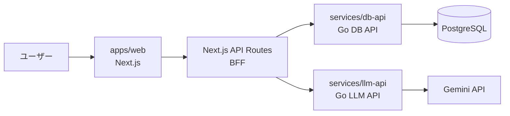

# KK　Lingo

KK Lingo は、PDFから復習問題を生成し、保存・共有できる学習支援システムです。ユーザーがPDFをアップロードすると、LLM APIが内容に基づいて問題を生成し、DB APIが生成された問題を保存・検索・共有できる形で管理します。

このリポジトリは、Next.jsのWebアプリ、Go製のDB API、Go製のLLM APIを1つのmonorepoで管理しています。画面だけでなく、問題生成とデータ永続化を別サービスとして分けることで、責務を明確にし、変更しやすい構成にしています。

## システム構成



ブラウザはNext.jsアプリの `/api/*` だけを呼び出します。Go APIに必要なAPIキーはNext.jsのサーバー側API Routesで付与するため、ブラウザ側には内部APIキーを露出しません。

## 技術スタック

| 領域 | 技術 |
| --- | --- |
| Web | Next.js 15, React 19 |
| DB API | Go, net/http, PostgreSQL, pgx, bcrypt |
| LLM API | Go, Gemini API |
| 認証/中継 | Next.js API Routes, Cookie, `X-API-Key` |
| CI | GitHub Actions |

## ディレクトリ構成

```text
.
├── apps/web              # Next.js WebアプリとBFF
├── services/db-api       # ユーザー・問題・検索を扱うGo API
├── services/llm-api      # PDFから問題生成を行うGo API
├── docs                  # 設計、API、DB、セキュリティの補足資料
├── infra                 # 将来のインフラ構成メモ
└── .github/workflows     # CI設定
```

## 各サービスの役割

### apps/web

ユーザーが操作するWebアプリです。PDFアップロード、問題生成、問題検索、解答、編集、ユーザー管理画面を提供します。`src/app/api/*` はBFFとして動き、ブラウザから直接Go APIを呼ばせずにサーバー側でリクエストを中継します。

### services/db-api

PostgreSQLに接続し、ユーザー、ログイン、問題CRUD、検索、公開/非公開状態を管理します。LLMやプロンプトには依存せず、保存と取得に集中します。

### services/llm-api

PDFをbase64文字列として受け取り、Gemini APIを使って復習問題を生成します。DBには接続せず、生成処理だけを担当します。

## 責務分離のポイント

- DB APIは「保存・検索・ユーザー管理」に集中する。
- LLM APIは「PDFから問題を生成する処理」に集中する。
- WebアプリはUIとBFFを担当し、内部APIキーをブラウザに出さない。
- LLMプロバイダーの変更やDB設計の変更を、それぞれ独立して進めやすい。

## ローカル起動

### 1. DB API

```bash
cd services/db-api
cp .env.example .env
go run .
```

デフォルトの起動先は `http://localhost:8080` です。

### 2. LLM API

```bash
cd services/llm-api
cp .env.example .env
go run .
```

デフォルトの起動先は `http://localhost:8001` です。

### 3. Webアプリ

```bash
cd apps/web
cp .env.example .env.local
npm install
npm run dev
```

デフォルトの起動先は `http://localhost:3000` です。

## 環境変数

Webアプリでは以下のような環境変数を使います。値は開発用サンプルなので、公開環境では必ず変更してください。

```env
GO_API_URL=http://localhost:8080
GEMINI_API_URL=http://localhost:8001
GO_API_KEY=local-dev-api-key
NEXT_PUBLIC_URL=http://localhost:3000
```

実際のAPIキーや接続先IPアドレスは `.env.local` や `.env` に置き、Gitにはコミットしない方針です。

## ドキュメント

- [アーキテクチャ](docs/architecture.md)
- [API概要](docs/api-overview.md)
- [データベース設計メモ](docs/database.md)
- [セキュリティメモ](docs/security.md)
- [プロジェクトメモ](docs/project-notes.md)
- [インフラ構成メモ](infra/README.md)

## 今後の改善

- CORS許可オリジンを環境ごとに制限する。
- Cookieベースの簡易セッションを、より安全なセッション管理またはJWT検証に置き換える。
- DBマイグレーションと初期データ投入を整備する。
- Go APIのテストとOpenAPI仕様を追加する。
- GitHub Actionsに依存関係スキャンやシークレットスキャンを追加する。
- 本番環境ではAPIキーやDB接続情報をSecret Managerなどで管理する。
