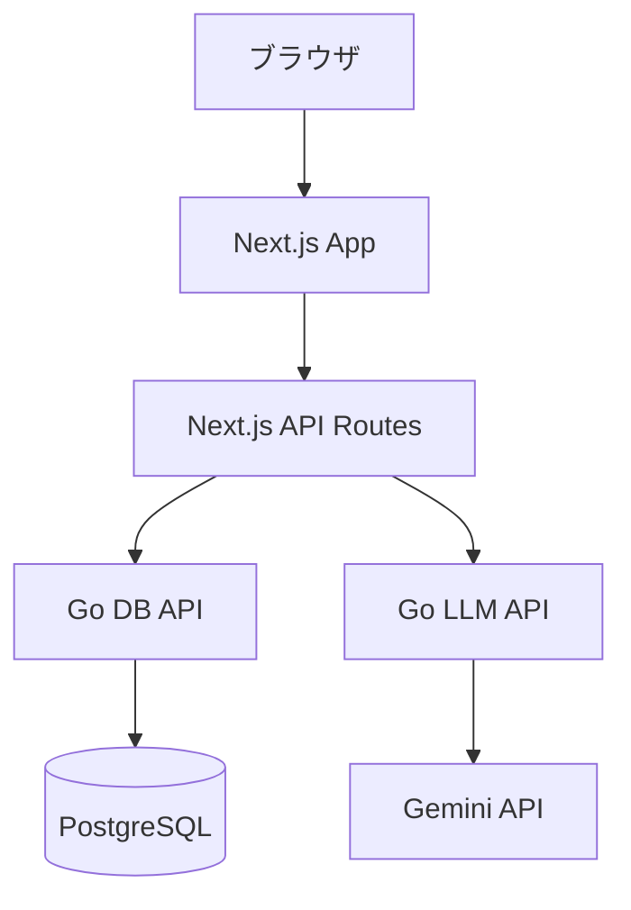

# アーキテクチャ

KK Lingo は、Webアプリ、DB API、LLM APIを分けて構成しています。問題生成とデータ保存は変更理由が異なるため、別サービスとして扱うことで責務を明確にしています。

## コンポーネント

| コンポーネント | パス | 役割 |
| --- | --- | --- |
| Web | `apps/web` | 画面、ユーザーフロー、BFF |
| DB API | `services/db-api` | ユーザー、ログイン、問題保存、検索、公開状態 |
| LLM API | `services/llm-api` | PDF入力、Geminiによる問題生成 |
| Docs | `docs` | 設計、API、DB、セキュリティの補足 |
| Infra | `infra` | 将来の配置構成メモ |

## 責務境界

- LLM APIはDBを知らない。
- DB APIはGeminiやプロンプト設計を知らない。
- WebアプリはUIとBFFを担当する。
- 内部APIキーはBFFで付与し、ブラウザには渡さない。

この構成により、LLM APIのモデルやプロンプトを変更してもDB APIに影響しにくくなります。同様に、DBスキーマや検索ロジックを改善しても、LLM生成処理とは独立して進められます。

## 問題生成から保存までの流れ

1. ユーザーが `apps/web` からPDFをアップロードする。
2. Next.jsのBFFが `services/llm-api` を呼び出す。
3. LLM APIがGemini APIを使って問題を生成する。
4. BFFが生成結果をDB API向けの形式に変換する。
5. BFFが `services/db-api` を呼び出して問題を保存する。
6. WebアプリはBFF経由で保存済み問題を検索・表示する。
